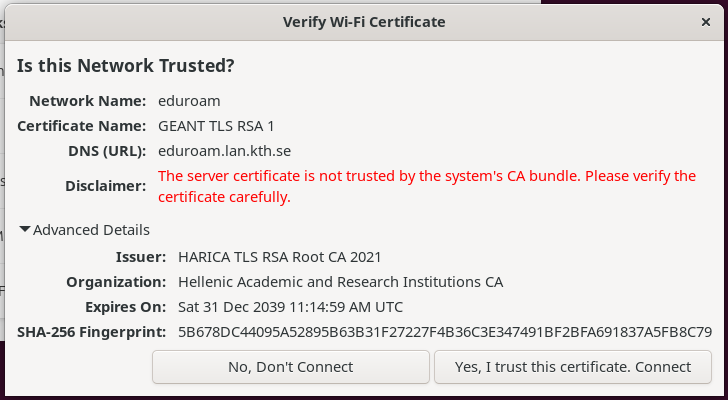

# NetworkManager Applet: TOFU GUI


This repository contains the graphical user interface (GUI) component for the **Trust on First Use (TOFU)** feature in NetworkManager. It is a modified version of the standard `network-manager-applet` (often seen as the Wi-Fi icon in the system tray on XFCE, MATE, and older GNOME desktop environments).

**Dependency Requirement:**  
This applet is just the graphical frontend. To actually use the TOFU feature, you **must** also compile and run the modified NetworkManager backend.  
**[Get the backend here: rathanappana/NetworkManager-TOFU](https://github.com/rathanappana/NetworkManager-TOFU)**

**Read the full research paper:**  
*[Secure Trust On First Use for Enterprise Wi-Fi](https://papers.mathyvanhoef.com/wisec2026.pdf)*  
**Authors:** Rathan Appana & Mathy Vanhoef (Presented at ACM WiSec 2026)


## Why is this repository needed?

The core `NetworkManager` daemon runs as a headless background service (running as root). When it encounters an unknown 802.1X Enterprise Wi-Fi certificate, it cannot draw a window on the user's screen. 

Instead, it sends a D-Bus request to a registered "Certificate Agent." 
* While we implemented text-based prompts directly into the `nmtui` utility (found in the backend repository), **this repository provides the native desktop pop-up dialogs**.
* When running this modified `nm-applet`, users will see a graphical prompt displaying the unknown certificate's fingerprint, giving them the option to "Accept" or "Reject" the connection.



## Build and Installation Guide

These instructions are tailored for Debian/Ubuntu-based systems. We recommend installing this custom applet systemwide. so you can start connecting to the network by selecting tray icon .


> <span style="color:red">**Prerequisite:** You must have source repositories (`deb-src`) enabled in your APT configuration (e.g., `/etc/apt/sources.list.d/ubuntu.sources`) to fetch NetworkManager's build dependencies.</span>


### Option A: Quick Install (Recommended for Researchers/Testing)

For artifact evaluation or quick setup, use the provided installation script. It will automatically install dependencies, compile the code, and install it to system wide.

```bash
git clone https://github.com/rathanappana/network-manager-applet-tofu.git
cd network-manager-applet-tofu

# GUI agents doesn't run with root access so sudo is not required
chmod +x install-nm-applet.sh

# Run the automated build and install script
./install-nm-applet.sh
```

### Option B: Manual Build (For Developers)
If you prefer to compile manually or actively monitoring the UI code.

1. Install dependencies
```bash
sudo apt update
sudo apt install meson ninja-build build-essential
sudo apt build-dep network-manager-applet
```

2. Configure and compile:
```bash
# Configure the build system wide
meson setup build --prefix=/usr --sysconfdir=/etc
ninja -C build
```

3. Install systemwide
```bash
sudo ninja -C build install
```

If your desktop environment is already running the system's default nm-applet, you need to kill the existing one and start your modified version.
```bash

# Kill the system's default nm-applet
killall nm-applet
# Start the modified TOFU-enabled nm-applet in the background
nm-applet &
```

Note: The applet relies on the TOFU-enabled NetworkManager daemon. Ensure the modified daemon is running, then try connecting to a TOFU-enabled Enterprise network (or use the `mac80211_hwsim` simulation script provided in the backend repository) to see the pop-up in action.

## Citation

If you use this code in your research, please cite our WiSec 2026 paper:
Code snippet
```tex
@inproceedings{appana2026tofu,
  title={Secure Trust On First Use for Enterprise Wi-Fi},
  author={Appana, Rathan and Vanhoef, Mathy},
  booktitle={Proceedings of the 19th ACM Conference on Security and Privacy in Wireless and Mobile Networks (WiSec '26)},
  year={2026}
}
```